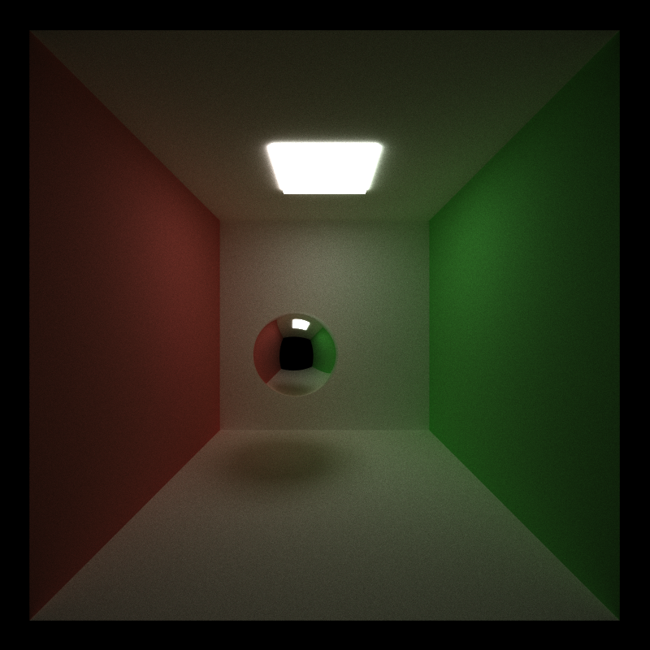
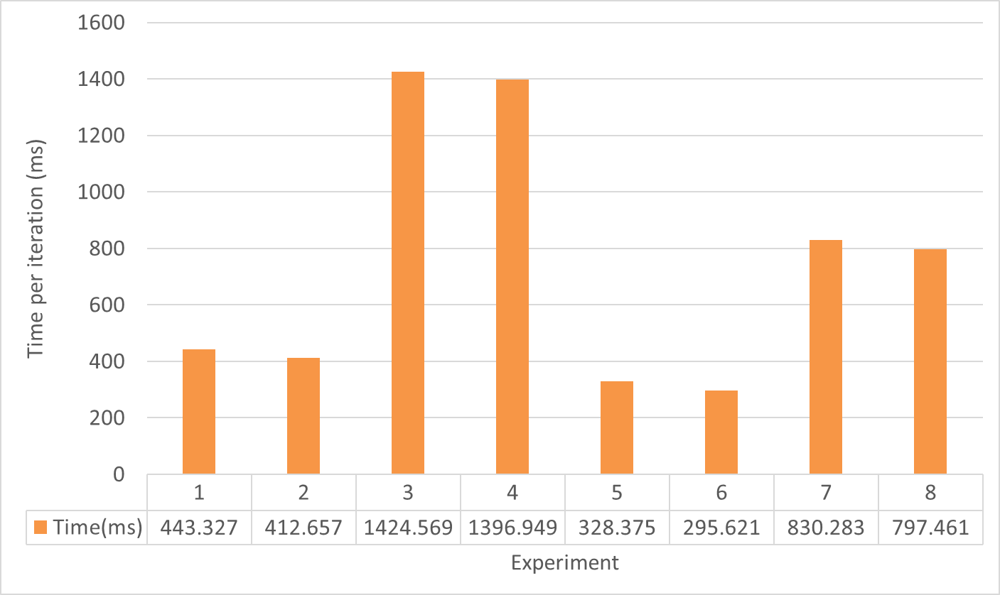
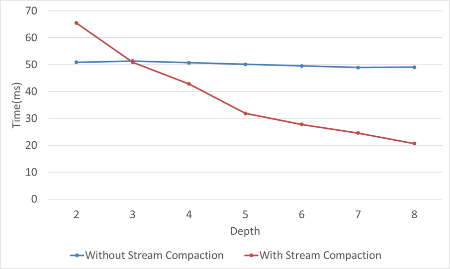
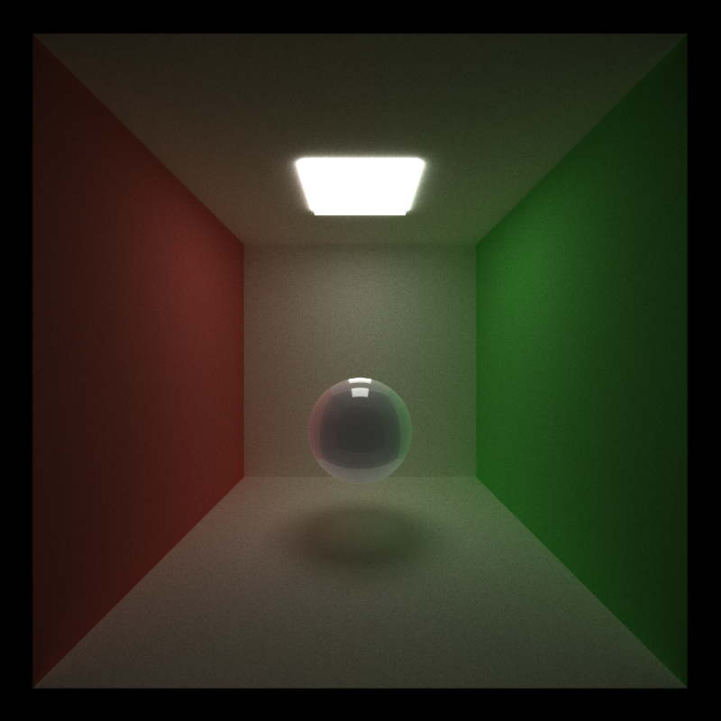
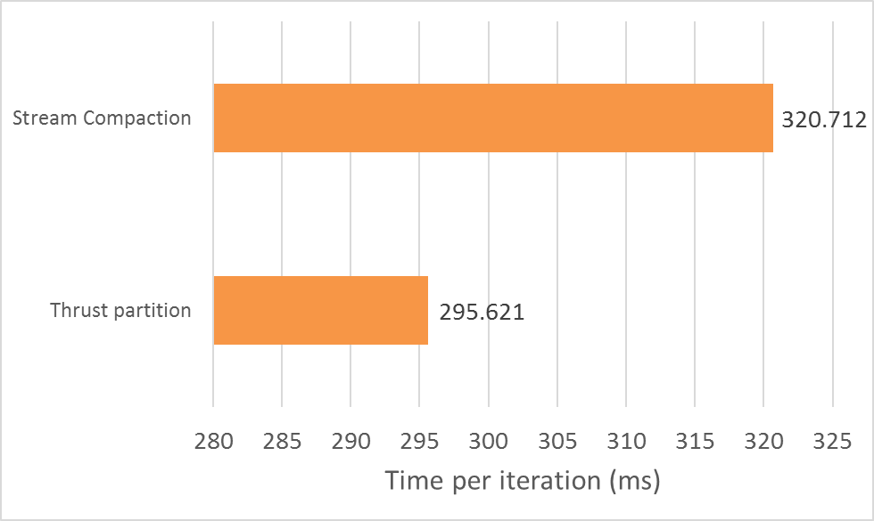

CUDA Path Tracer
================

**University of Pennsylvania, CIS 565: GPU Programming and Architecture, Project 3**

* Nischal K N
* Tested on: Windows 7, i7-4790 @ 3.60GHz 16GB, Quadro K20 1GB (Moore 100B Lab)

### SUMMARY
This project implements a path tracer using GPU. Following are the features implemented
* Shading kernel with BSDF evaluation
* Caching of first bounce intersection
* Sorting of intersections by material type
* Refraction using Schlick's approximation
* Stochastic Antialiasing
* Path termination by stream compaction using `thrust::partition` and `StreamCompaction::efficient`

An analysis of performance with different combinations of caching, sorting and stream compaction is documented. Also the performance improvement due to stream compaction is shown.

### OUTPUT

### BUILD INSTRUCTIONS
* To setup cuda development environment use [this guide](https://github.com/nischalkn/Project0-CUDA-Getting-Started/blob/master/INSTRUCTION.md#part-1-setting-up-your-development-environment)
* Once the environment is set up, to Build and run the project follow [this](https://github.com/nischalkn/Project0-CUDA-Getting-Started/blob/master/INSTRUCTION.md#part-3-build--run)

### PARAMETERS
* `SORTING` - `1` or `0`, Enable\\Disable sorting intersections by material
* `CACHING` - `1` or `0`, Enable\\Disable caching of first intersection for same camera position
Note: Enabling this disables Antialiasing
* `EFFICIENT_COMPACTION` - `0`,`1` or `2`, Set the type of stream compaction for termination of rays.
  * `0` - No termination, fixed depth
  * `1` - efficient stream compaction using `StreamCompaction::efficient::compact`
  * `2` - stream compaction using `thrust::partition`
* `PROFILE` - `1` or `0`, Print execution time for 2000 iterations

### ANALYSIS
Eight different experiments were conducted with different combinations of parameters. The time taken for executing 2000 iterations was recorded and the findings are shown in the table below

|Expt |`COMPACTION`|`SORTING`|`CACHING`|Total Time(s)|Average Time(ms)|
|:---:|:---:|:---:|:---:|:---:|:---:|
|1  | 0 | 0 | 0 |886.652 | 443.327|
|2  | 0 | 0 | 1 |825.312 |412.657 |
|3  | 0 | 1 | 0 |2849.136 |1424.569 |
|4  | 0 | 1 | 1 |2793.896 |1396.949 |
|5  | 1 | 0 | 0 |656.751 |328.375 |
|6  | 1 | 0 | 1 |591.242 |295.621 |
|7  | 1 | 1 | 0 |1660.564 |830.283 |
|8  | 1 | 1 | 1 |1594.92 |797.461 |

From the table it can be seen that the execution is the fastest when caching is enabled as expected. However enabling sorting should ideally speed up the execution but the findings were contradictory. This was because the overhead of sorting overshadows any advantage gained from sequential memory access. A graph representing this data is shown below. Also enabling stream compaction speeds up the computation as terminated rays are removed from the buffer. The effect of this is evaluated in more detail in the following section.

## Effect of Stream Compaction on execution times
An Analysis was conducted to understand the effect of early termination of rays using stream compaction. The time taken by the implementation to bounce and shade the rays over different depth levels were recorded. It was averaged over 500 iterations for 8 depth/bounces.

From the graph it is seen that initially at depth 2 when there are not many rays that are terminated, using stream compaction is bad as the overhead of terminating the few rays is not advantageous. But as the number of bounces increase, the time taken to complete the iteration drastically improves.

## Refraction
Refraction was implemented using using Schlick's approximation. The following is the output

## Antialiasing
Antialiasing was implemented by jittering the initial ray from the camera. Antialiasing is disabled when `CACHING` is enabled.

## Efficient Stream compaction
Rays are terminated and removed from the pool when the number of remaining bounces are zero. This is done using stream compaction. An efficient scan is used to compact the rays. The performance of this implementation vs `thrust::partition` is as follows

The efficient method performs slower than the thrust implementation because of the time needed for memory allocation of intermediate binary and scan arrays.
